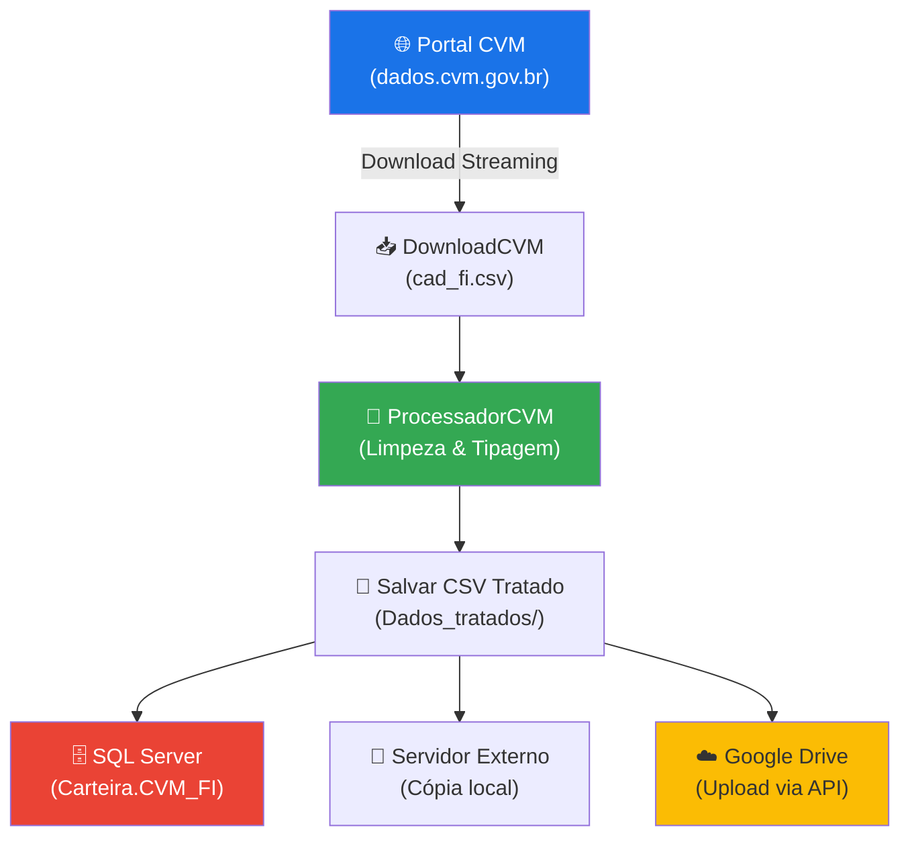

# 📊 CVM Dados Abertos — Pipeline de ETL

Pipeline automatizado de **Extração, Transformação e Carga (ETL)** dos dados abertos de **Fundos de Investimento** da Comissão de Valores Mobiliários (CVM), com integração ao SQL Server e Google Drive.

---

## 🧭 Visão Geral

Este projeto automatiza o fluxo completo de coleta, tratamento e distribuição dos dados cadastrais de fundos de investimento (`cad_fi.csv`) disponibilizados pela CVM. O pipeline realiza:

1. **Download** do arquivo CSV direto do portal de dados abertos da CVM via streaming
2. **Tratamento e limpeza** dos dados (higienização de CNPJ, remoção de duplicatas, tipagem)
3. **Salvamento** da base tratada em disco local
4. **Carga em lote** no banco de dados SQL Server
5. **Cópia** do arquivo tratado para diretório de servidor externo
6. **Upload** para o Google Drive via API oficial

---

## 🏗️ Arquitetura do Projeto

```
CVM_dados_aberto/
│
├── main.py                          # Orquestrador principal do pipeline
├── .env                             # Variáveis de ambiente (credenciais e configurações)
├── credentials.json                 # Credenciais da API do Google (não versionado)
├── token.json                       # Token OAuth2 do Google (não versionado)
│
├── services/                        # Camada de serviços
│   ├── DownloadCVM.py               # Download via streaming do arquivo da CVM
│   ├── ProcessadorCVM.py            # Limpeza, sanitização e tipagem dos dados
│   ├── SQLServerConnection.py       # Gerenciador de conexão com SQL Server (Context Manager)
│   ├── CVMRepository.py             # Repositório para carga em lote no banco de dados
│   ├── ServidorExternoService.py    # Cópia do arquivo para servidor/diretório externo
│   ├── GoogleDriveAPIService.py     # Upload via API oficial do Google Drive
│   └── GoogleDriveUploader.py       # Upload alternativo via navegador automatizado
│
├── codigos_sql/                     # Scripts DDL do banco de dados
│   └── tabela.sql                   # Criação da tabela Carteira.CVM_FI
│
└── Temp_File/                       # Diretório temporário (não versionado)
    ├── Dados_brutos/                # Arquivo CSV bruto baixado da CVM
    ├── Dados_tratados/              # Arquivo CSV limpo e tratado
    └── Servidor_Externo/            # Cópia para distribuição externa
```

---

## ⚙️ Fluxo do Pipeline



---

## 🧹 Tratamento de Dados

O módulo `ProcessadorCVM` executa o seguinte pipeline de limpeza:

| Etapa | Descrição |
|-------|-----------|
| **Higienização de CNPJ/CPF** | Remove `.`, `/` e `-` das colunas `CNPJ_FUNDO`, `CNPJ_ADMIN`, `CPF_CNPJ_GESTOR`, `CNPJ_AUDITOR`, `CNPJ_CUSTODIANTE`, `CNPJ_CONTROLADOR` |
| **Remoção de duplicatas** | Remove registros duplicados pela chave primária `CNPJ_FUNDO`, mantendo o último registro |
| **Tratamento de nulos** | Substitui strings vazias, `nan`, `None` e `NaN` por `NULL` nativo |
| **Limpeza de textos** | Remove espaços em branco nas extremidades de todas as colunas de texto |
| **Conversão de datas** | Converte 9 colunas de data para o formato `YYYY-MM-DD` |
| **Conversão numérica** | Converte `TAXA_PERFM`, `TAXA_ADM`, `VL_PATRIM_LIQ` para `float` e `CD_CVM` para `Int64` |

---

## 🚀 Como Executar

### 1. Pré-requisitos

- **Python 3.10+**
- **SQL Server** com ODBC Driver 17 instalado
- **Conta Google Cloud** (para upload ao Google Drive)

### 2. Clonar o repositório

```bash
git clone https://github.com/AdonesMelo/CVM_Dados_Abertos.git
cd CVM_Dados_Abertos
```

### 3. Criar e ativar o ambiente virtual

```bash
python -m venv venv

# Windows (PowerShell)
.\venv\Scripts\Activate.ps1

# Linux / macOS
source venv/bin/activate
```

### 4. Instalar dependências

```bash
pip install -r requirements.txt
```

### 5. Configurar variáveis de ambiente

Crie um arquivo `.env` na raiz do projeto:

```env
# Banco de Dados SQL Server
DB_SERVER=SEU_SERVIDOR
DB_DATABASE=SUA_BASE
DB_USERNAME=seu_usuario
DB_PASSWORD=sua_senha
DB_DRIVER={ODBC Driver 17 for SQL Server}

# URL da CVM e diretórios
URL_CVM=https://dados.cvm.gov.br/dados/FI/CAD/DADOS/cad_fi.csv
DADOS_BRUTOS=.\Temp_File\Dados_brutos
DADOS_TRATADOS=.\Temp_File\Dados_tratados

# Google Drive
GOOGLE_DRIVE_FOLDER_ID=id_da_pasta_no_drive
SERVIDOR_EXTERNO_DIR=.\Temp_File\Servidor_Externo
```

### 6. Configurar credenciais do Google Drive

1. Acesse o [Google Cloud Console](https://console.cloud.google.com/)
2. Crie um projeto e ative a **Google Drive API**
3. Crie uma credencial **OAuth 2.0 Client ID** (Tipo: Aplicativo de Desktop)
4. Faça o download do `credentials.json` e coloque na raiz do projeto

### 7. Criar a tabela no SQL Server

Execute o script DDL no seu banco de dados:

```sql
-- codigos_sql/tabela.sql
CREATE TABLE Carteira.CVM_FI (
    TP_FUNDO VARCHAR(50),
    CNPJ_FUNDO VARCHAR(14) PRIMARY KEY,
    DENOM_SOCIAL NVARCHAR(MAX),
    DT_REG DATE,
    -- ... (41 colunas no total)
);
```

### 8. Executar o pipeline

```bash
python main.py
```

---

## 📋 Estrutura da Tabela `Carteira.CVM_FI`

<details>
<summary>Clique para expandir — 41 colunas</summary>

| Coluna | Tipo | Descrição |
|--------|------|-----------|
| `TP_FUNDO` | `VARCHAR(50)` | Tipo do fundo |
| `CNPJ_FUNDO` | `VARCHAR(14)` | CNPJ do fundo (PK) |
| `DENOM_SOCIAL` | `NVARCHAR(MAX)` | Denominação social |
| `DT_REG` | `DATE` | Data de registro |
| `DT_CONST` | `DATE` | Data de constituição |
| `CD_CVM` | `INT` | Código CVM |
| `DT_CANCEL` | `DATE` | Data de cancelamento |
| `SIT` | `VARCHAR(50)` | Situação do fundo |
| `DT_INI_SIT` | `DATE` | Data de início da situação |
| `DT_INI_ATIV` | `DATE` | Data de início da atividade |
| `DT_INI_EXERC` | `DATE` | Data de início do exercício |
| `DT_FIM_EXERC` | `DATE` | Data de fim do exercício |
| `CLASSE` | `VARCHAR(50)` | Classe do fundo |
| `DT_INI_CLASSE` | `DATE` | Data de início da classe |
| `RENTAB_FUNDO` | `NVARCHAR(200)` | Rentabilidade do fundo |
| `CONDOM` | `VARCHAR(50)` | Tipo de condomínio |
| `FUNDO_COTAS` | `CHAR(1)` | Fundo de cotas (S/N) |
| `FUNDO_EXCLUSIVO` | `CHAR(1)` | Fundo exclusivo (S/N) |
| `TRIB_LPRAZO` | `CHAR(1)` | Tributação de longo prazo (S/N) |
| `PUBLICO_ALVO` | `VARCHAR(50)` | Público alvo |
| `ENTID_INVEST` | `CHAR(1)` | Entidade de investimento (S/N) |
| `TAXA_PERFM` | `FLOAT` | Taxa de performance |
| `INF_TAXA_PERFM` | `NVARCHAR(MAX)` | Informações da taxa de performance |
| `TAXA_ADM` | `FLOAT` | Taxa de administração |
| `INF_TAXA_ADM` | `NVARCHAR(MAX)` | Informações da taxa de administração |
| `VL_PATRIM_LIQ` | `DECIMAL(18,2)` | Valor do patrimônio líquido |
| `DT_PATRIM_LIQ` | `DATE` | Data do patrimônio líquido |
| `DIRETOR` | `VARCHAR(200)` | Diretor responsável |
| `CNPJ_ADMIN` | `VARCHAR(14)` | CNPJ do administrador |
| `ADMIN` | `VARCHAR(300)` | Nome do administrador |
| `PF_PJ_GESTOR` | `CHAR(2)` | PF ou PJ do gestor |
| `CPF_CNPJ_GESTOR` | `VARCHAR(20)` | CPF/CNPJ do gestor |
| `GESTOR` | `VARCHAR(300)` | Nome do gestor |
| `CNPJ_AUDITOR` | `VARCHAR(14)` | CNPJ do auditor |
| `AUDITOR` | `VARCHAR(300)` | Nome do auditor |
| `CNPJ_CUSTODIANTE` | `VARCHAR(14)` | CNPJ do custodiante |
| `CUSTODIANTE` | `VARCHAR(300)` | Nome do custodiante |
| `CNPJ_CONTROLADOR` | `VARCHAR(14)` | CNPJ do controlador |
| `CONTROLADOR` | `VARCHAR(300)` | Nome do controlador |
| `INVEST_CEMPR_EXTER` | `CHAR(1)` | Investimento no exterior (S/N) |
| `CLASSE_ANBIMA` | `VARCHAR(300)` | Classificação ANBIMA |

</details>

---

## 🔧 Tecnologias Utilizadas

| Tecnologia | Finalidade |
|------------|------------|
| **Python 3** | Linguagem principal |
| **pandas** | Manipulação e limpeza de dados |
| **requests** | Download HTTP via streaming |
| **pyodbc** | Conexão e carga no SQL Server |
| **python-dotenv** | Gerenciamento de variáveis de ambiente |
| **google-api-python-client** | Upload para o Google Drive via API REST |
| **google-auth-oauthlib** | Autenticação OAuth2 com o Google |

---

## 📂 Fonte de Dados

Os dados são obtidos do portal oficial de **Dados Abertos da CVM**:

🔗 [https://dados.cvm.gov.br/dados/FI/CAD/DADOS/cad_fi.csv](https://dados.cvm.gov.br/dados/FI/CAD/DADOS/cad_fi.csv)

O arquivo `cad_fi.csv` contém os **dados cadastrais de todos os fundos de investimento** registrados na CVM, incluindo informações como CNPJ, denominação social, situação, gestor, administrador, auditor, patrimônio líquido, entre outros.

---

## 📄 Licença

Este projeto é de uso pessoal e educacional.

---

## 👤 Autor

**Adones Melo**

[](https://github.com/AdonesMelo)
